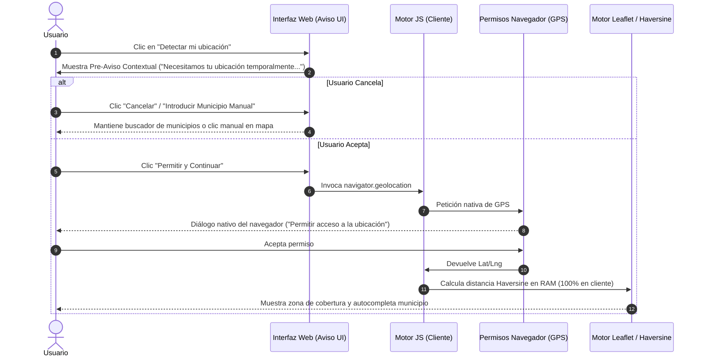

# 🛡️ Plan de Cumplimiento Normativo: Privacidad, RGPD y Arquitectura *Privacy by Design*

> **Documento de Referencia Técnica y Legal para Portfolio / Entrevistas de Selección**  
> **Proyecto:** Quintanamur S.L. Web Platform  
> **Área:** Ingeniería de Software, Seguridad & Privacidad, Consultoría Legal-Tech y Gobierno de Datos  
> **Marco Regulatorio:** RGPD (Reglamento UE 2016/679), LOPDGDD (Ley Orgánica 3/2018), LSSI-CE (Ley 34/2002) y Guías de la AEPD.

---

## 1. 🎯 Resumen Ejecutivo y Objetivos

En aplicaciones web modernas orientadas a servicios de ingeniería civil, agrícola y logística, la captura de **datos identificativos de clientes** (leads de contacto) y **datos de geolocalización de alta precisión** (coordenadas GPS) sitúa la privacidad en el núcleo de la arquitectura.

Este documento establece el **plan de implementación técnica y procedimental** para garantizar el cumplimiento estricto de la normativa europea y española, adoptando el principio de **Privacidad desde el Diseño y por Defecto (*Privacy by Design & by Default*, Art. 25 RGPD)**.

```
                              ARQUITECTURA DE PRIVACIDAD INTEGRAL
                                                │
         ┌────────────────────────┬─────────────┴─────────────┬────────────────────────┐
         ▼                        ▼                           ▼                        ▼
 [ BASES LEGALES & AEPD ]  [ FORMULARIO DE CONTACTO ]  [ AVISO GEOLOCALIZACIÓN ]  [ GESTIÓN DE COOKIES ]
 • Facilita RGPD (AEPD)    • Checkbox Opt-in explícito • Pre-aviso contextual UI  • Banner 3 opciones CMP
 • RAT (Registro Tratam.)  • Cláusula 1ª Capa (Art.11) • Procesamiento en cliente • Bloqueo previo scripts
 • Minimización de datos   • Validación frontend/API   • No persistencia server   • Consentimiento granular
```

---

## 2. 🏛️ Marco Legal y Bases de Legitimación (AEPD Facilita RGPD)

### A. Herramienta Facilita RGPD de la AEPD
Para empresas y plataformas de baja exposición al riesgo como Quintanamur S.L., la **Agencia Española de Protección de Datos (AEPD)** pone a disposición la herramienta oficial **Facilita RGPD**. Mediante un cuestionario estructurado sobre la actividad comercial y los canales digitales, se genera la documentación legal base:
1. **Registro de Actividades de Tratamiento (RAT)** (Art. 30 RGPD).
2. **Plantilla de Política de Privacidad** personalizada.
3. **Cláusulas informativas por capas** para formularios web y presupuestos.
4. **Directrices de medidas de seguridad mínimas** (cifrado en tránsito, control de accesos, copias de seguridad).

### B. Matriz de Tratamiento de Datos (Data Governance Matrix)

| Actividad de Tratamiento | Datos Recopilados | Base de Legitimación (Art. 6 RGPD) | Finalidad | Plazo de Conservación |
| :--- | :--- | :--- | :--- | :--- |
| **Solicitud de Presupuesto / Contacto** | Nombre, Teléfono, Email, Sector, Localización declarada, Mensaje | **Consentimiento explícito** (Art. 6.1.a) y **Medidas precontractuales** (Art. 6.1.b) | Gestión de consultas comerciales y emisión de presupuestos personalizados de maquinaria/servicios. | Duración de la relación comercial o hasta revocación del consentimiento (máx. 2 años de inactividad). |
| **Cálculo de Cobertura Logística** | Coordenadas GPS (`lat`, `lng`), Municipio derivado | **Consentimiento explícito** informado mediante interfaz previa (Art. 6.1.a) | Comprobar si la parcela/obra está dentro del radio preferente de 100 km desde Yecla. | **Efímero (Sesión/Memoria RAM)**. No se almacena en BD salvo que el usuario lo adjunte al enviar el formulario. |
| **Analítica de Navegación (Opcional)** | IP anonimizada, ID de sesión, páginas vistas, eventos de interacción | **Consentimiento del usuario** (Art. 22.2 LSSI-CE / Art. 6.1.a RGPD) | Optimización técnica del sitio, métricas de rendimiento y UX. | Según configuración de cookies aceptadas (máx. 13 meses). |

---

## 3. 📝 Diseño e Implementación del Formulario de Contacto

### A. Principios Normativos
1. **Consentimiento libre, específico, informado e inequívoco** (Art. 4.11 y Art. 7 RGPD).
2. **Prohibición de casillas premarcadas**: La casilla de verificación debe estar desmarcada por defecto. El envío no puede procesarse si la casilla no es marcada voluntariamente.
3. **Información por Capas (Art. 11 LOPDGDD)**: Mostrar un resumen claro y accesible antes del envío con enlace a la segunda capa (Política de Privacidad completa).

### B. Especificación Técnica de UI y Validación

```
+-------------------------------------------------------------------+
|  [ ] He leído y acepto la Política de Privacidad *                |
+-------------------------------------------------------------------+
|  ℹ️ INFORMACIÓN BÁSICA DE PROTECCIÓN DE DATOS                      |
|  • Responsable: Quintanamur S.L.                                  |
|  • Finalidad: Atender su solicitud y emitir presupuesto.          |
|  • Legitimación: Su consentimiento expreso.                      |
|  • Destinatarios: No se cederán datos a terceros salvo ley.       |
|  • Derechos: Acceso, rectificación, supresión y otros (ver web).  |
|  • Info completa: [Política de Privacidad](/privacidad)          |
+-------------------------------------------------------------------+
|  [             SOLICITAR PRESUPUESTO ->                          ] |
+-------------------------------------------------------------------+
```

#### Código HTML / Astro de Referencia:
```html
<!-- Checkbox de Consentimiento Obligatorio (Desmarcado por Defecto) -->
<div class="flex items-start gap-3 my-4">
  <input
    type="checkbox"
    id="privacy-consent"
    name="privacy_consent"
    required
    class="mt-1 h-4 w-4 rounded border-outline focus:ring-primary text-primary cursor-pointer"
  />
  <label for="privacy-consent" class="text-sm text-on-surface-variant leading-snug cursor-pointer">
    He leído y acepto la 
    <a href="/politica-de-privacidad" target="_blank" rel="noopener noreferrer" class="text-primary underline font-medium hover:text-primary-fixed-dim">
      Política de Privacidad
    </a>
    <span class="text-error font-bold" title="Campo obligatorio">*</span>
  </label>
</div>

<!-- Cláusula de Primera Capa (Art. 11 LOPDGDD) -->
<div class="p-3 bg-surface-container-low rounded-lg border border-outline-variant/40 text-xs text-on-surface-variant/90 space-y-1 mb-4">
  <div class="font-bold text-on-surface flex items-center gap-1.5 mb-1">
    <span class="material-symbols-outlined text-sm text-primary">gavel</span>
    Información Básica de Protección de Datos
  </div>
  <p><strong>Responsable:</strong> Quintanamur S.L. (Yecla, Murcia).</p>
  <p><strong>Finalidad:</strong> Gestionar la solicitud de información y presupuesto solicitado.</p>
  <p><strong>Legitimación:</strong> Consentimiento del interesado al marcar la casilla y enviar el formulario.</p>
  <p><strong>Destinatarios:</strong> No se ceden datos a terceros salvo obligación legal o soporte técnico de hosting bajo contrato DPA.</p>
  <p><strong>Derechos:</strong> Acceder, rectificar, suprimir sus datos y demás derechos en <code class="text-xs font-mono">info@quintanamur.com</code>.</p>
</div>
```

---

## 4. 📍 Aviso Previo de Geolocalización (*Privacy by Design*)

### A. Problemática y Riesgo
Disparar directamente `navigator.geolocation.getCurrentPosition()` sin aviso previo genera rechazo en el usuario (desconfianza) y puede vulnerar las directrices de transparencia de la AEPD al no clarificar la **finalidad exacta** de la solicitud de ubicación en el momento de la captura.

### B. Flujo de Consentimiento en Dos Fases (Double-Opt-In UX)



### C. Implementación Técnica del Pre-Aviso Modal / Popover

```javascript
// Función disparadora con aviso contextual previo
function requestGeolocationWithPreConsent() {
  // 1. Mostrar diálogo contextual antes de invocar la API del navegador
  const preModal = document.getElementById('geo-pre-consent-modal');
  if (preModal) {
    preModal.classList.remove('hidden');
  }
}

// 2. Al confirmar el usuario en la interfaz:
function executeNativeGeolocation() {
  if (!navigator.geolocation) {
    alert("Tu navegador no admite geolocalización.");
    return;
  }

  navigator.geolocation.getCurrentPosition(
    (position) => {
      const { latitude, longitude } = position.coords;
      // Procesamiento local en memoria (fórmula de Haversine)
      calculateClientSideCoverage(latitude, longitude);
      // Cierre del modal
      closeGeoPreConsentModal();
    },
    (error) => {
      console.warn("Permiso denegado o error de geolocalización:", error.message);
      // Fallback amigable: invitar a buscar municipio por texto
      highlightManualSearchInput();
    },
    { enableHighAccuracy: true, timeout: 8000, maximumAge: 0 }
  );
}
```

* **Mensaje Clave de UI:**
  > *"Necesitamos tu ubicación temporalmente para comprobar si tu obra o parcela se encuentra dentro de nuestra zona de cobertura preferente (radio de 100 km desde Yecla). Tus coordenadas se procesan de forma local en tu navegador y no quedan registradas en nuestros servidores."*

---

## 5. 🍪 Banner de Gestión de Cookies (CMP - LSSI-CE & AEPD)

### A. Requisitos de la Guía de Cookies de la AEPD (Última Revisión)
1. **Simetría de Opciones**: El botón de **"Rechazar todas"** debe tener la misma visibilidad, tamaño y facilidad de acceso que el de **"Aceptar todas"**.
2. **Configuración Granular**: Posibilidad de activar/desactivar por categorías (Técnicas, Analíticas, Marketing).
3. **No Precarga (Zero-Cookie Load)**: Las cookies analíticas o de terceros no pueden descargarse antes de que el usuario pulse "Aceptar".
4. **Persistencia del Estado**: Guardar el consentimiento en `localStorage` (`cookie_consent_choice = { necessary: true, analytics: false, timestamp: ... }`).

### B. Arquitectura de Componentes del CMP

```
+-----------------------------------------------------------------------------------+
|  🍪 Control de Privacidad y Cookies                                              |
|                                                                                   |
|  Utilizamos cookies técnicas necesarias para el funcionamiento del sitio web y,  |
|  si nos autorizas, cookies analíticas para mejorar nuestros servicios logísticos  |
|  y de maquinaria. Puedes aceptar, rechazar o configurar su uso.                  |
|                                                                                   |
|  [ Rechazar No Esenciales ]   [ Configurar ]   [ Aceptar Todas ]                  |
|                                                                                   |
|  Más detalles en nuestra [Política de Cookies](/cookies)                         |
+-----------------------------------------------------------------------------------+
```

#### Estructura del Estado en `localStorage`:
```json
{
  "consent_version": "1.0",
  "timestamp": "2026-09-01T13:00:00.000Z",
  "categories": {
    "technical_necessary": true,
    "analytics": false,
    "marketing": false
  }
}
```

---

## 6. 💼 Guion de Defensa en Entrevistas Técnicas (Consultoría / Tech Lead)

A continuación se detallan las preguntas habituales en entrevistas de selección (Capgemini, NTT DATA, Deloitte, Accenture, empresas de producto) y las respuestas técnicas fundamentadas en este proyecto:

### ❓ Pregunta 1: *"¿Cómo abordaste la privacidad al capturar la ubicación del usuario para el mapa logístico?"*
> **Respuesta Clave:**  
> *"Apliqué el principio de **Privacy by Design y Minimización de Datos (Art. 5 y 25 RGPD)**. En lugar de enviar las coordenadas GPS a un backend para calcular la distancia, ejecuté el algoritmo de **Haversine directamente en el cliente (JavaScript)** contra las coordenadas fijas de Yecla. Además, implementé un **pre-aviso de consentimiento contextual en la UI** antes de disparar el aviso nativo del navegador, explicando que la geolocalización es de uso temporal y no persistente. Solo si el usuario decide formalizar un lead, el municipio derivado viaja en el payload del formulario."*

### ❓ Pregunta 2: *"¿Qué medidas se adoptaron para garantizar la validez legal del formulario de contacto?"*
> **Respuesta Clave:**  
> *"Nos apoyamos en las pautas oficiales de la AEPD y su herramienta **Facilita RGPD**. El formulario cuenta con un checkbox de consentimiento explícito no premarcado (`opt-in`), validación estricta de envío (`required`), y una **cláusula informativa de primera capa** bajo el Art. 11 de la LOPDGDD con los 6 puntos clave (Responsable, Finalidad, Legitimación, Destinatarios, Derechos y enlace a la Política de Privacidad de 2ª capa)."*

### ❓ Pregunta 3: *"¿Cómo asegurarías el cumplimiento en un pipeline de analítica si en el futuro se instrumenta Google Analytics o BigQuery?"*
> **Respuesta Clave:**  
> *"Implementaría una arquitectura de **Consent-Gated Analytics**: ningún script de medición se carga hasta que el CMP devuelve un consentimiento afirmativo para la categoría `analytics`. Para el pipeline de datos (Cloud Storage / BigQuery), aplicaría **seudonimización y hashing criptográfico (SHA-256)** sobre identificadores personales antes de la ingesta en el Data Lake, separando los datos identificativos del comportamiento de navegación."*

---

## 7. 📋 Hoja de Ruta de Ejecución Técnica (Checklist Futura)

- [ ] **Fase 1: Documentación Legal Base**
  - [ ] Ejecutar el cuestionario de **Facilita RGPD** (AEPD) para Quintanamur S.L.
  - [ ] Redactar las páginas estáticas `/politica-de-privacidad`, `/aviso-legal` y `/politica-de-cookies`.
- [ ] **Fase 2: Frontend Formulario de Contacto (`contacto.astro`)**
  - [ ] Integrar el checkbox de consentimiento obligatorio desmarcado por defecto.
  - [ ] Insertar la tarjeta de primera capa informativa del Art. 11 LOPDGDD.
- [ ] **Fase 3: Geolocalización Segura**
  - [ ] Añadir el componente modal/popover de pre-aviso contextual previo a `navigator.geolocation`.
- [ ] **Fase 4: Cookie Consent Manager**
  - [ ] Crear el componente `CookieBanner.astro` con selector granular (Aceptar / Rechazar / Configurar).
  - [ ] Almacenar la preferencia en `localStorage` e integrar el script de control condicional.
