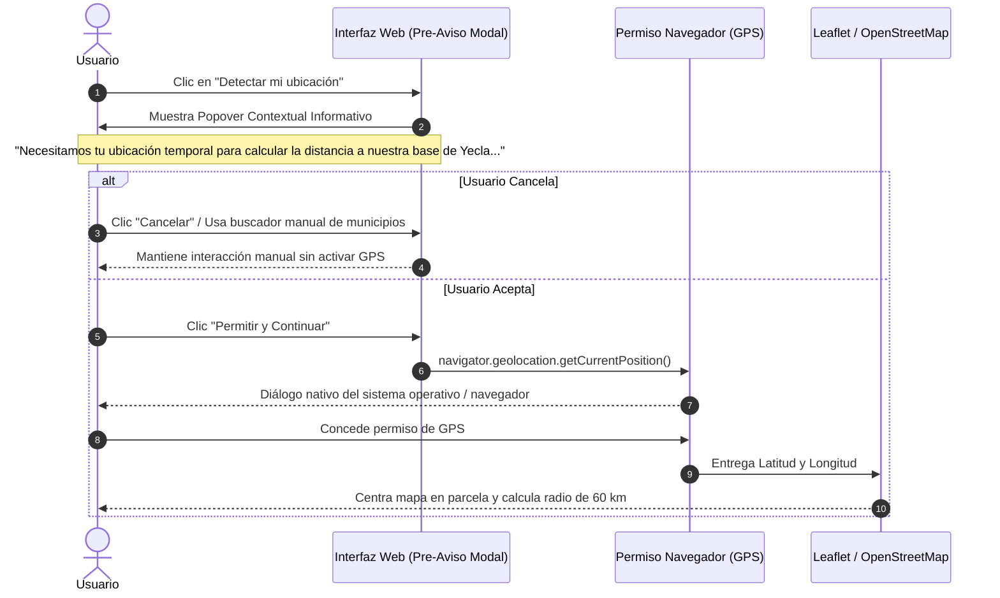
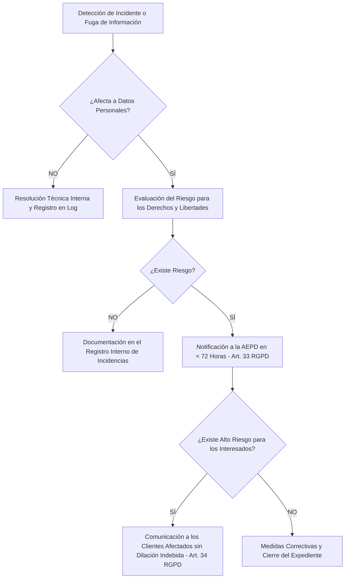

# 🛡️ Plan Integral de Cumplimiento Normativo: Privacidad, RGPD y Arquitectura *Privacy by Design*

> **Documento de Auditoría Técnica, Cumplimiento Legal y Excelencia en Ingeniería del Software**  
> **Proyecto:** Plataforma Web & Plataforma de Datos Quintanamur S.L.  
> **Área:** Ingeniería de Software, Seguridad y Privacidad (*Privacy Engineering*), Consultoría Legal-Tech y Gobierno del Dato  
> **Marco Regulatorio:** RGPD (Reglamento UE 2016/679), LOPDGDD (Ley Orgánica 3/2018), LSSI-CE (Ley 34/2002), Directiva ePrivacy 2002/58/CE y Guías de la Agencia Española de Protección de Datos (AEPD).  
> **Última Actualización y Revisión de Arquitectura:** Septiembre 2026

---

## 1. 🎯 Resumen Ejecutivo, Objeto y Alcance del Proyecto

### A. Contexto y Finalidad del Negocio
**Quintanamur S.L.** es una empresa especializada en servicios integrales de **ingeniería civil, movimientos de tierra pesados, despedregado automatizado y servicios agrícolas de precisión**, con base operativa central en **Yecla (Región de Murcia)** y ámbito de actuación preferente en la comarca del Altiplano, Alicante, Albacete y áreas limítrofes del Levante español.

La plataforma digital de Quintanamur no es un simple folleto estático, sino un **ecosistema tecnológico distribuido** que integra:
1. **Frontend Dinámico y Resiliente (Astro 5 + SSR / Cloudflare Workers):** Presentación del parque de maquinaria pesada, servicios técnicos y captación de clientes.
2. **Herramienta Geoespacial Interactiva (Leaflet + OpenStreetMap):** Detección y selección de fincas o parcelas con cálculo de distancia geodésica (fórmula de Haversine) a la base de Yecla (radio de 60-100 km).
3. **Formulario de Presupuestación y Captación de Leads (`contacto.astro`):** Ingesta de datos de contacto comercial, sector de actividad y especificaciones del terreno.
4. **Backend Serverless con Idempotencia y Resiliencia (`/api/lead.ts`):** Validación estricta, filtrado perimetral contra bots (Honeypot tarpit), rate-limiting y registro auditable de consentimiento.
5. **Base de Datos Operacional Transaccional (Neon PostgreSQL 16 + PostGIS):** Persistencia relacional segura en centro de datos europeo (Frankfurt, `eu-central-1`).
6. **Despacho Operativo Inmediato (Telegram Bot API & Protocolo WhatsApp Web):** Notificación en tiempo real al equipo de operaciones y rescate comercial ante incidentes de conectividad rural.
7. **Pipeline Automatizado ELT y Data Warehouse (Python `elt_pipeline.py` ➔ Google BigQuery ➔ Power BI / Looker Studio):** Analítica predictiva de demanda comarcal y modelado dimensional mediante Star Schema.

### B. El Reto de Privacidad y Enfoque Normativo
La confluencia de **datos personales identificativos directos** (nombre, teléfono, correo electrónico), **datos de geolocalización espacial de alta precisión** (coordenadas GPS de parcelas y fincas rústicas), y el procesamiento de telemetría analítica exige aplicar de forma estricta los principios de **Privacidad desde el Diseño y por Defecto (*Privacy by Design and by Default*, Art. 25 RGPD)** y **Minimización de Datos (Art. 5.1.c RGPD)** en todas y cada una de las capas de la arquitectura.

```
                                  MAPA DE GOBERNANZA Y PRIVACIDAD DEL DATO
                                                      │
         ┌─────────────────────────┬──────────────────┴──────────────────┬─────────────────────────┐
         ▼                         ▼                                     ▼                         ▼
 [ CAPA FRONTEND & UX ]   [ PERÍMETRO API & EDGE ]              [ ALMACENAMIENTO OLTP ]   [ ANALÍTICA & BI (OLAP) ]
 • Consentimiento Opt-in   • Validación simétrica                • Neon Postgres (Frankfurt)• BigQuery (Dataset EU)
 • Cláusula 1ª Capa Art.11 • Honeypot tarpit anti-bot            • Conexión SSL obligatoria• Supresión de PII directa
 • Pre-aviso GPS en RAM    • Rate-Limiter (IP enmascarada)       • Marca de tiempo inmutable• Seudonimización (Art. 4.5)
 • Draft TTL 24h seguro    • Registro probatorio consentimiento  • Cifrado AES-256 reposo  • Star Schema disociado
```

---

## 2. 🏛️ Registro de Actividades de Tratamiento (RAT - Art. 30 RGPD)

De acuerdo con el **Artículo 30 del RGPD** y en cumplimiento de las directrices de la herramienta **Facilita RGPD de la AEPD**, Quintanamur S.L. mantiene actualizado el Registro de Actividades de Tratamiento correspondiente a los canales digitales y sistemas de información vinculados a la plataforma web.

### A. Identificación del Responsable del Tratamiento
* **Denominación Social:** Quintanamur S.L.
* **NIF:** B-XXXXXXXX *(Registrado en Registro Mercantil de Murcia)*
* **Domicilio Social:** Yecla, Región de Murcia (España)
* **Correo Electrónico de Contacto y Privacidad:** `privacidad@quintanamur.com` / `info@quintanamur.com`
* **Delegado de Protección de Datos (DPO):** No preceptivo según Art. 37 RGPD y Art. 34 LOPDGDD (actividad de bajo riesgo, sin tratamiento masivo de categorías especiales de datos). Las funciones de supervisión de privacidad son asumidas internamente por la Dirección Técnica y Legal-Tech.

---

### B. Matriz de Tratamiento de Datos (Data Governance Matrix)

| Actividad de Tratamiento | Categorías de Datos Tratados | Colectivo de Interesados | Base Legal Principal (Art. 6 RGPD) | Finalidad Específica | Destinatarios y Encargados | Plazo de Conservación |
| :--- | :--- | :--- | :--- | :--- | :--- | :--- |
| **1. Gestión de Solicitudes de Presupuesto y Leads** | • Nombre y Apellidos / Razón Social<br>• Teléfono de contacto<br>• Email (opcional)<br>• Sector (Agrícola / Civil / Otro)<br>• Municipio y descripción del trabajo<br>• Evidencia de consentimiento (fecha/hora) | Usuarios web que solicitan valoración económica o consulta técnica de maquinaria. | **Consentimiento explícito** (Art. 6.1.a RGPD) y **Aplicación de medidas precontractuales** (Art. 6.1.b RGPD). | Tramitar la consulta, evaluar la viabilidad técnica, elaborar el presupuesto de obra/maquinaria y contactar al cliente. | • Cloudflare (Edge/Hosting)<br>• Neon Inc. (BBDD PostgreSQL en Frankfurt)<br>No se ceden a terceros comerciales. | Duración de la negociación del presupuesto; en caso de no formalizarse contrato, máximo 2 años desde el último contacto comercial. |
| **2. Evaluación de Cobertura y Geolocalización GPS** | • Coordenadas GPS (`user_lat`, `user_lng`)<br>• Distancia kilométrica calculada<br>• Municipio derivado por geocodificación inversa | Usuarios que activan voluntariamente la detección de ubicación o sitúan el pin en el mapa. | **Consentimiento explícito e informado** del interesado en el navegador (Art. 6.1.a RGPD). | Comprobar si la parcela/finca se ubica en el radio de 60 km (cobertura directa) o hasta 100+ km (gran proyecto logístico). | Procesamiento 100% efímero en memoria RAM cliente (Haversine). Solo si el usuario envía el formulario se persiste en Neon PostgreSQL asociado al lead. | • Efímero en memoria local del navegador.<br>• Si se envía el formulario: idéntico al lead comercial (2 años). |
| **3. Despacho Operativo y Alertas Críticas** | • ID de lead<br>• Nombre y teléfono cliente<br>• Resumen del mensaje y sector<br>• Enlace directo a WhatsApp Web / Teléfono | Personal de guardia y técnicos de operaciones de Quintanamur S.L. | **Ejecución de medidas precontractuales** a solicitud del interesado (Art. 6.1.b RGPD) e **Interés legítimo** organizativo (Art. 6.1.f RGPD). | Notificar al equipo comercial en menos de 60 segundos para garantizar respuesta en <24h laborables y permitir rescate comercial si la BD falla. | • Telegram Messenger FZ-LLC (vía Bot API privado cifrado de uso estrictamente interno). | Los mensajes en el canal privado de Telegram se purgan periódicamente (máximo 6 meses). |
| **4. Analítica de Demanda y Business Intelligence** | • Coordenadas geográficas agregadas<br>• Municipio y sector de actividad<br>• Categoría de maquinaria requerida<br>• Puntuación de calidad (*Lead Quality Score*)<br>• Estimación de costes logísticos de porte | Registros agregados de leads comerciales (disociados de PII directa). | **Interés legítimo** (Art. 6.1.f RGPD) y fines estadísticos / optimización de rutas (Art. 89 RGPD). | Analizar la densidad territorial de demanda comarcal, planificar inversiones en nueva maquinaria pesada y optimizar desplazamientos de góndola. | • Google Cloud Platform (BigQuery en región europea `EU`)<br>• Microsoft Power BI / Looker Studio (cuadros de mando internos). | Datos estadísticos disociados y agregados: conservación indefinida con fines de planificación estratégica. |
| **5. Seguridad Perimetral y Prevención de Fraude** | • Dirección IP (con enmascaramiento perimetral)<br>• Indicador de trampa Honeypot (`business_website`)<br>• Marca de tiempo del intento<br>• Cabeceras técnicas de petición HTTP | Conexiones entrantes a los endpoints de la API (`/api/lead`). | **Interés legítimo** del Responsable en garantizar la seguridad de las redes e información (Art. 6.1.f RGPD y Considerando 49 RGPD). | Neutralizar ataques de denegación de servicio (DoS), inyecciones de spam malicioso y saturación de recursos mediante *tarpit*. | Cloudflare, Inc. (análisis de tráfico perimetral). | Las IPs bloqueadas en memoria volátil expiran a los 60 segundos. En alertas de seguridad, la IP se envía anonimizada (`xxx`). |

---

## 3. 📝 Captura de Consentimiento y Diseño del Formulario (`contacto.astro`)

### A. Exigencias del Consentimiento Bajo el RGPD (Art. 4.11 y Art. 7)
El consentimiento en Quintanamur S.L. cumple de forma irrestricta los cuatro atributos obligatorios exigidos por el marco normativo europeo:
1. **Libre:** El acceso a la información técnica de servicios y maquinaria no está condicionado a la aceptación de finalidades comerciales accesorias. No existe venta cruzada encubierta.
2. **Específico:** La finalidad de tratamiento está acotada estrictamente a la valoración del presupuesto solicitado.
3. **Informado:** El usuario dispone de la cláusula de primera capa de información en el mismo campo de visión que el botón de envío y la casilla de verificación.
4. **Inequívoco y mediante Acción Afirmativa:** Está **terminantemente prohibido el uso de casillas premarcadas (*opt-in* por omisión)**. El checkbox de consentimiento se renderiza desmarcado por defecto (`checked = false`) y requiere un clic expreso y consciente del usuario.

---

### B. Cláusula Informativa por Capas (Art. 11 LOPDGDD y Guías AEPD)

En cumplimiento del principio de transparencia (Art. 12 y 13 RGPD) y el modelo de información por capas regulado en el **Artículo 11 de la Ley Orgánica 3/2018 (LOPDGDD)**:

#### 1ª Capa (Información Básica en Formulario de Contacto):
Se ubica inmediatamente antes del botón de envío (`submit-lead-btn`), integrada en el diseño visual del formulario:

```
┌─────────────────────────────────────────────────────────────────────────────┐
│ [ ] He leído y acepto la Política de Privacidad para el tratamiento y        │
│     valoración técnica de mi solicitud de presupuesto. *                    │
├─────────────────────────────────────────────────────────────────────────────┤
│ ℹ️ INFORMACIÓN BÁSICA SOBRE PROTECCIÓN DE DATOS (Art. 11 LOPDGDD)            │
│ • Responsable: Quintanamur S.L. (Yecla, Murcia).                             │
│ • Finalidad: Gestionar y valorar técnica y económicamente su solicitud.      │
│ • Legitimación: Consentimiento expreso del interesado y medidas precontrac. │
│ • Destinatarios: No se ceden datos a terceros. Alojamiento en servidores     │
│   seguros de la UE (Neon Frankfurt / Cloudflare) bajo contrato DPA.          │
│ • Derechos: Acceder, rectificar, suprimir sus datos y otros derechos        │
│   dirigiéndose a privacidad@quintanamur.com.                                │
│ • Información adicional: Consulte la [Política de Privacidad Completa].     │
└─────────────────────────────────────────────────────────────────────────────┘
```

#### Código HTML / Astro Implementado y Auditado:
```html
<!-- Checkbox de Consentimiento Obligatorio y Desmarcado por Defecto -->
<div class="flex flex-col gap-1 pt-1">
  <label class="flex items-start gap-3 cursor-pointer group select-none">
    <input
      type="checkbox"
      id="privacy-consent"
      name="privacy_consent_accepted"
      required
      class="mt-1 w-4 h-4 rounded border-outline-variant text-primary focus:ring-primary cursor-pointer accent-primary"
    />
    <span class="font-body-md text-xs sm:text-sm text-on-surface-variant leading-snug">
      He leído y acepto la
      <a
        href="/politica-de-privacidad"
        target="_blank"
        rel="noopener noreferrer"
        class="text-primary underline font-medium hover:text-primary/80"
      >
        política de privacidad
      </a>
      para el tratamiento y valoración de mi solicitud.
      <span class="text-error font-bold" title="Campo obligatorio">*</span>
    </span>
  </label>
  <span id="error-privacy" class="hidden text-xs text-error font-medium flex items-center gap-1 mt-0.5">
    <span class="material-symbols-outlined text-sm">error</span>
    <span>Debes aceptar la política de privacidad para procesar la valoración.</span>
  </span>
</div>

<!-- Cuadro Informativo de Primera Capa (Art. 11 LOPDGDD) -->
<div class="mt-3 p-3.5 bg-surface-container rounded-xl border border-outline-variant/30 text-xs text-on-surface-variant space-y-1.5 leading-relaxed">
  <div class="font-bold text-on-surface flex items-center gap-1.5 pb-1 border-b border-outline-variant/20">
    <span class="material-symbols-outlined text-sm text-primary" style="font-variation-settings: 'FILL' 1;">gavel</span>
    <span>Información Básica de Protección de Datos</span>
  </div>
  <p><strong>Responsable:</strong> Quintanamur S.L. (Yecla, Murcia · NIF: B-XXXXXXXX).</p>
  <p><strong>Finalidad:</strong> Tramitar la consulta comercial, evaluar la viabilidad técnica y elaborar el presupuesto solicitado.</p>
  <p><strong>Legitimación:</strong> Su consentimiento explícito al marcar la casilla y enviar el formulario (Art. 6.1.a y 6.1.b RGPD).</p>
  <p><strong>Destinatarios:</strong> No se ceden datos a terceros salvo obligación legal. Infraestructura alojada en servidores de la UE bajo acuerdos DPA.</p>
  <p><strong>Derechos:</strong> Acceso, rectificación, supresión, limitación y oposición en <code class="font-mono text-primary font-bold">privacidad@quintanamur.com</code>.</p>
  <p class="pt-0.5"><strong>Segunda Capa:</strong> Puede consultar el texto íntegro en nuestra <a href="/politica-de-privacidad" class="underline text-primary hover:text-primary/80">Política de Privacidad detallada</a>.</p>
</div>
```

---

### C. Registro Probatorio Inmutable en Servidor (*Accountability*, Art. 5.2 RGPD)
El principio de **Responsabilidad Proactiva** exige que el Responsable sea capaz de demostrar documentalmente que el consentimiento fue otorgado de manera válida.

En el backend (`src/pages/api/lead.ts`), cada solicitud procesada con éxito almacena en Neon PostgreSQL:
```sql
INSERT INTO raw_leads (
    client_name,
    client_phone,
    client_email,
    service_category,
    machinery_interest,
    municipality_name,
    user_lat,
    user_lng,
    distance_to_base_km,
    coverage_status,
    message_text,
    privacy_consent_accepted,      -- TRUE (Verificado y validado en servidor)
    privacy_consent_timestamp,     -- NOW() con zona horaria UTC / Europe/Madrid
    lead_source
) VALUES ( ... );
```
* **Validación Simétrica en Servidor:** Si `privacy_consent_accepted !== true`, la petición es rechazada de inmediato con código HTTP 400 Bad Request, impidiendo cualquier inserción en base de datos.
* **Trazabilidad Forense:** En caso de auditoría o reclamación ante la AEPD, la tupla `(lead_id, created_at, privacy_consent_accepted, privacy_consent_timestamp)` constituye una prueba fehaciente del momento exacto del consentimiento.

---

### D. Gobernanza del Borrador Temporal en `localStorage` (Resiliencia con Privacidad)
Para evitar que clientes que operan en entornos rurales con cobertura intermitente pierdan el texto de su solicitud tras redactar descripciones técnicas complejas, la aplicación implementa guardado automático en `localStorage` (`quintanamur_lead_draft`).

**Evaluación de Impacto de Privacidad y Medidas de Blindaje:**
1. **Entornos Agrarios Compartidos:** En cooperativas agrarias y casetas de obra, es frecuente el uso de ordenadores o tablets compartidos por varios agricultores o encargados. Un borrador indefinido expondría nombres y teléfonos ajenos.
2. **Implementación de Caducidad Estricta (TTL 24 Horas):**
   ```javascript
   const DRAFT_KEY = "quintanamur_lead_draft";
   const DRAFT_TTL_MS = 24 * 60 * 60 * 1000; // 24 horas

   // Al cargar la página: purga inmediata si ha expirado
   const savedDraftRaw = localStorage.getItem(DRAFT_KEY);
   if (savedDraftRaw) {
     const draft = JSON.parse(savedDraftRaw);
     if (Date.now() - draft.timestamp > DRAFT_TTL_MS) {
       localStorage.removeItem(DRAFT_KEY); // Purga preventiva
     } else {
       // Restauración controlada de campos
     }
   }
   ```
3. **Purga Inmediata tras Envío Exitoso:** En cuanto el endpoint `/api/lead` responde con código 200/201, se ejecuta `localStorage.removeItem(DRAFT_KEY)` de forma síncrona.
4. **Almacenamiento 100% Local:** El contenido del borrador reside exclusivamente en el dispositivo del usuario; ningún dato de borrador se transmite a servidores hasta que el usuario acciona activamente el botón de envío tras marcar la casilla de privacidad.

---

## 4. 📍 Tratamiento de Coordenadas GPS y Geolocalización (*Privacy by Design*)

### A. Calificación Jurídica de las Coordenadas Geográficas
Las coordenadas de latitud y longitud (`lat`, `lng`) referidas a una finca, parcela rústica o ubicación en tiempo real de un usuario constituyen **datos personales** según el Criterio del Comité Europeo de Protección de Datos (EDPB) y la AEPD, en la medida en que permiten identificar directa o indirectamente al titular de una explotación catastral o la posición física del solicitante.

---

### B. Arquitectura de Procesamiento en RAM y Algoritmo de Haversine Local
Quintanamur aplica el principio de **Minimización de Datos (Art. 5.1.c RGPD)** eliminando cualquier transmisión innecesaria de coordenadas al servidor durante la interacción cartográfica:

```
[ Navegador del Usuario ]
  │
  ├─ 1. Clic en mapa o detección GPS
  ├─ 2. Coordenadas (lat, lng) se mantienen en variables de ámbito local (window / RAM)
  ├─ 3. Ejecución de la fórmula geodésica de Haversine en el cliente:
  │      d = 2R · atan2(√a, √(1−a)) contra Base Yecla (38.6136, -1.1166)
  ├─ 4. Geocodificación inversa con OpenStreetMap / Nominatim (solo nombre del municipio)
  └─ 5. Representación visual del radio de 60 km en Leaflet
       │
       ▼ [ CERO PETICIONES AL BACKEND DE QUINTANAMUR ]
       (No se envían coordenadas a servidores de Quintanamur hasta el submit)
```

Solo si el usuario decide culminar el proceso enviando el formulario de contacto, las coordenadas seleccionadas viajan en el payload JSON para calcular la logística de traslado de maquinaria en góndola pesada y generar la geometría PostGIS (`geom`).

---

### C. Protocolo de Pre-Aviso Contextual (*Double-Opt-In UX*)
Disparar de manera automática o inesperada la API nativa `navigator.geolocation.getCurrentPosition()` genera desconfianza y colisiona con el principio de transparencia de la AEPD. Por ello, el sistema adopta un **flujo de consentimiento previo en dos fases**:



* **Texto del Pre-Aviso Informativo en Interfaz:**
  > *"Utilizaremos tu ubicación de manera temporal y exclusiva para calcular si tu parcela o terreno se encuentra dentro de nuestra zona de cobertura preferente (radio de 60 km desde Yecla). Las coordenadas se procesan de forma local en tu navegador y no se transferirán a nuestros servidores a menos que decidas enviar la solicitud de presupuesto."*

---

## 5. 📊 Analítica y Business Intelligence: Seudonimización y Minimización (ELT -> BigQuery -> Power BI)

### A. Separación de Entornos: OLTP vs. OLAP
El ecosistema de Quintanamur implementa una **estricta segregación de responsabilidades de datos**:
1. **Entorno Operacional Transaccional (OLTP - Neon PostgreSQL en Frankfurt):** Contiene la tabla `raw_leads` con los datos personales íntegros de contacto para uso exclusivo del personal comercial y de despacho de obras.
2. **Entorno Analítico y Cuadros de Mando (OLAP - Google BigQuery en región `EU`):** Destinado al análisis estadístico de demanda territorial, optimización de rutas de góndola y rendimiento de maquinaria.

---

### B. Cumplimiento de los Principios de Seudonimización y Disociación (Art. 4.5, 5.1.c y Art. 89 RGPD)
Para alimentar el cuadro de mando en **Power BI Desktop** (`bi/quintanamur_analytics.pbix`) y **Looker Studio**, el pipeline automatizado `scripts/elt_pipeline.py` y la transformación SQL `scripts/sql/create_fact_leads_analytics.sql` aplican una **disociación radical de la identidad del cliente**:

```sql
-- scripts/sql/create_fact_leads_analytics.sql
CREATE OR REPLACE TABLE `quintanamur_warehouse.fact_leads_analytics` AS
SELECT 
    lead_id,                          -- Identificador numérico disociado
    created_at AS lead_timestamp,     -- Dimensión temporal
    DATE(created_at) AS lead_date,
    EXTRACT(YEAR FROM created_at) AS lead_year,
    EXTRACT(MONTH FROM created_at) AS lead_month,
    FORMAT_DATE('%B', DATE(created_at)) AS lead_month_name,
    service_category,                 -- 'agricola', 'civil', 'otro'
    COALESCE(machinery_interest, 'Sin especificar') AS machinery_interest,
    COALESCE(municipality_name, 'Desconocido') AS municipality_name,
    user_lat,                         -- Coordenadas agregadas para mapa de calor
    user_lng,
    distance_to_base_km,
    coverage_status,
    COALESCE(lead_status, 'NUEVO') AS lead_status,
    lead_source,

    -- Métricas de Negocio Calculadas (Sin acceso a PII)
    CASE 
        WHEN service_category = 'civil' THEN 'Ticket Alto (Obra Civil)'
        WHEN service_category = 'agricola' AND distance_to_base_km <= 50 THEN 'Ticket Recurrente Local'
        ELSE 'Ticket Estándar'
    END AS business_segment,

    -- Ponderación de Calidad Técnica del Lead (Derivada, sin almacenar el texto del cliente)
    CASE 
        WHEN client_email IS NOT NULL AND LENGTH(message_text) > 25 THEN 100
        WHEN client_email IS NOT NULL OR LENGTH(message_text) > 15 THEN 75
        ELSE 45
    END AS lead_quality_score,

    -- Estimación Logística de Transporte
    ROUND(distance_to_base_km * 2 * 1.85, 2) AS estimated_logistics_cost_eur

FROM `quintanamur_warehouse.raw_leads_sync`;
```

#### Análisis de Conformidad Técnica:
* **Exclusión de PII Directa:** Los campos `client_name`, `client_phone`, `client_email` y `message_text` **no forman parte de la tabla de hechos `fact_leads_analytics`**.
* **Protección del Analista:** Quien accede a Power BI o a los informes ejecutivos trabaja exclusivamente sobre métricas agregadas, segmentos y dispersión geográfica comarcal, sin capacidad de identificar a la persona física solicitante.
* **Soberanía y Residencia Europea del Dato:** Tanto el dataset de BigQuery (`quintanamur_warehouse`) como el servidor de Neon se ubican exclusivamente en la **Unión Europea (Ubicación multirregión `EU` y Frankfurt `eu-central-1`)**, garantizando el cumplimiento de las restricciones de transferencias internacionales de datos del Capítulo V del RGPD.

---

## 6. 🌐 Encargados del Tratamiento y Transferencias Internacionales (Capítulo V RGPD)

Conforme al **Artículo 28 del RGPD**, todos los proveedores tecnológicos que intervienen como **Encargados del Tratamiento (Data Processors)** disponen de los correspondientes Acuerdos de Tratamiento de Datos (*Data Processing Agreements* - DPA) y mecanismos de adecuación internacional conformes al marco legal post-Schrems II:

| Proveedor Tecnológico | Función en la Plataforma | Ubicación del Tratamiento | Instrumento de Transferencia Internacional / Garantía Legal |
| :--- | :--- | :--- | :--- |
| **Cloudflare, Inc.** | Alojamiento perimetral (Edge CDN, Cloudflare Workers, DNS y Firewall Anti-DDoS). | Red global Anycast con procesamiento de bordes en España y UE. Servidores principales en EE.UU./UE. | Adhesión al **EU-US Data Privacy Framework (DPF)** y Cláusulas Contractuales Tipo (SCCs) aprobadas por la Comisión Europea (Decisión 2021/914/UE). |
| **Neon Database Inc. (AWS)** | Base de datos PostgreSQL transaccional serverless (`neondb`). | **Frankfurt, Alemania (`eu-central-1`)** | Sin transferencia internacional fuera del EEE. Almacenamiento en centros de datos de Amazon Web Services en Alemania bajo DPA estricto con Neon Inc. |
| **Google Cloud Platform (Google Cloud EMEA DAC)** | Data Warehouse BigQuery para analítica y cuadro de mando Power BI. | **Región Europea (`EU`)** | Google Cloud EMEA DAC (sede en Dublín, Irlanda). Almacenamiento dentro del EEE, complementado con SCCs y certificación EU-US DPF. |
| **Telegram Messenger FZ-LLC** | Despacho interno de alertas operativas mediante Bot API cifrado. | Infraestructura distribuida en centros de datos seguros. | Utilizado exclusivamente como canal interno de alerta operativa técnica hacia el personal autorizado de Quintanamur. Sin reutilización comercial. |
| **OpenStreetMap Foundation** | Teselas cartográficas y servicio de geocodificación inversa Nominatim. | Reino Unido / Unión Europea | **Decisión de Adecuación de la Comisión Europea** para el Reino Unido (Art. 45 RGPD). Peticiones anónimas TLS sin datos identificativos directos. |

---

## 7. 🔐 Medidas de Seguridad Técnicas y Organizativas (Art. 32 RGPD) y Gestión de Brechas

En aplicación del principio de **Integridad y Confidencialidad (Art. 5.1.f RGPD)** y el **Artículo 32 del RGPD**, Quintanamur implementa controles de seguridad de estándar industrial adaptados al riesgo del tratamiento:

### A. Seguridad Criptográfica y en Comunicaciones
1. **Cifrado en Tránsito:** Tráfico web forzado bajo protocolo seguro **HTTPS / TLS 1.3** con certificados gestionados por Cloudflare. La conexión entre la aplicación Astro y Neon PostgreSQL exige de manera inmutable el flag `sslmode=require`.
2. **Cifrado en Reposo:** Las tablas en Neon PostgreSQL se almacenan en volúmenes cifrados mediante **AES-256**. De igual modo, las tablas de BigQuery se cifran en reposo utilizando claves gestionadas por Google Cloud (FIPS 140-2 Nivel 3).
3. **Control de Inyección SQL:** Todas las consultas en `/api/lead.ts` se ejecutan mediante plantillas parametrizadas nativas del SDK `@neondatabase/serverless` (`sql` template tags), neutralizando vectores de inyección SQL.

---

### B. Blindaje Perimetral, Rate Limiting y Sanitización de Registros
1. **Trampa Silenciosa Honeypot (`business_website`):** Neutralización de bots automáticos de spam sin alterar la experiencia de usuarios legítimos, evitando la polución de la base de datos y la exposición de credenciales.
2. **Rate Limiting Anti-Ráfaga por IP en Memoria:** Control deslizante de 60 segundos con umbral de 5 fallos. Si se supera, el sistema corta el flujo y emite una alerta crítica.
3. **Sanitización Rigurosa de Logs y Alertas (`src/utils/criticalAlert.ts`):**  
   Antes de emitir cualquier diagnóstico de error a Telegram o a los registros de Cloudflare, la función `sanitizeLog()` limpia activamente contraseñas de conexión a bases de datos (`postgresql://***:***@`), tokens de API y **enmascara las direcciones IP** (ocultando el último bloque de red con `xxx`), impidiendo que logs técnicos se conviertan en vectores de fuga de datos personales.

---

### C. Protocolo de Detección y Notificación de Brechas de Seguridad (Arts. 33 y 34 RGPD)
La plataforma cuenta con un sistema de telemetría y alerta en tiempo real (`sendCriticalAlert`) que clasifica los incidentes técnicos:
* `CRIT-01`: Caída o timeout de la base de datos operacional.
* `CRIT-02`: Error interno 500 no controlado en el Worker.
* `CRIT-04`: Ráfaga anómala de peticiones o ataque perimetral neutralizado.

#### Procedimiento de Respuesta ante Incidentes de Seguridad:


1. **Notificación a la AEPD (Art. 33):** Si se confirma una brecha que constituya un riesgo para los derechos y libertades de las personas físicas, Quintanamur notificará a la Agencia Española de Protección de Datos a través de su Sede Electrónica en un plazo **máximo de 72 horas** tras haber tenido constancia de la misma.
2. **Comunicación al Interesado (Art. 34):** Si el riesgo es alto, se informará a los afectados en lenguaje claro y sencillo, detallando la naturaleza del incidente, los datos afectados y las medidas recomendadas.

---

## 8. 🍪 Política de Cookies y Tecnologías de Almacenamiento (LSSI-CE Art. 22.2)

### A. Diagnóstico del Estado Actual: *Zero-Cookie Architecture*
Actualmente, la plataforma web de Quintanamur S.L. opera bajo el principio de **Arquitectura de Cero Cookies Invasivas**:
* **Sin Cookies de Rastreo de Terceros:** No se inyectan cookies de seguimiento cruzado, analítica intrusiva ni píxeles publicitarios (ej. Meta Pixel, TikTok Ads, Hotjar).
* **Almacenamiento Local Estrictamente Técnico:** El uso de `localStorage` (`quintanamur_lead_draft`) tiene carácter estrictamente funcional y técnico (resiliencia del borrador del formulario ante cortes de red), exento del deber de consentimiento conforme al **Artículo 22.2 de la LSSI-CE**.

---

### B. Especificación del Gestor de Consentimiento (CMP) para Futuras Extensiones
En previsión de que en el futuro se instrumente analítica web avanzada (ej. Google Analytics 4 bajo Google Tag Manager o Cloudflare Web Analytics):
1. **Regla de Carga Cero (*Zero-Load by Default*):** Ningún script de medición analítica ni etiqueta de terceros podrá descargarse ni ejecutarse en el navegador antes de que el usuario emita un consentimiento positivo.
2. **Simetría de Opciones (Directrices AEPD):** El banner CMP presentará en la misma capa y con idéntico realce visual:
   * Botón **"Rechazar no necesarias"**.
   * Botón **"Aceptar todas"**.
   * Botón **"Configurar preferencias"** (selector granular por categorías: Técnicas, Analíticas, Rendimiento).

---

## 9. ⚖️ Protocolo de Ejercicio de Derechos ARSOPOL (Arts. 15 a 22 RGPD)

Los usuarios de la plataforma y clientes de Quintanamur S.L. tienen garantizado el ejercicio gratuito de los derechos reconocidos en la legislación vigente:

* **Acceso (Art. 15 RGPD):** Saber si Quintanamur trata sus datos, con qué finalidad y qué datos concretos se conservan.
* **Rectificación (Art. 16 RGPD):** Corregir datos inexactos o incompletos aportados en el formulario de solicitud de maquinaria.
* **Supresión / Derecho al Olvido (Art. 17 RGPD):** Solicitar la eliminación de sus datos personales cuando ya no sean necesarios para los fines que motivaron su recogida o se revoque el consentimiento.
* **Limitación del Tratamiento (Art. 18 RGPD):** Solicitar la congelación temporal del tratamiento en los supuestos previstos por la norma.
* **Portabilidad (Art. 20 RGPD):** Recibir sus datos personales en formato estructurado, de uso común y lectura mecánica (JSON o CSV).
* **Oposición (Art. 21 RGPD):** Oponerse en cualquier momento a tratamientos basados en interés legítimo.
* **Derecho a No Ser Objeto de Decisiones Individualizadas Automatizadas (Art. 22 RGPD):** Quintanamur no adopta ninguna decisión jurídica vinculante sobre los usuarios basada exclusivamente en algoritmos o perfilado automatizado.

### Procedimiento Operativo y Plazos:
* **Canal Habilitado:** Solicitud escrita remitida por correo electrónico a `privacidad@quintanamur.com` indicando en el asunto *"Ejercicio de Derechos de Protección de Datos"*, aportando nombre completo, teléfono de contacto y copia de documento identificativo (DNI/NIE) solo en caso de duda razonable sobre la identidad del solicitante.
* **Plazo de Respuesta Legal:** Máximo **1 mes** desde la recepción de la solicitud (prorrogable a 2 meses en casos de especial complejidad, notificando previamente al interesado).
* **Tutela Judicial y Reclamación:** Se informa expresamente al interesado de su derecho a presentar una reclamación ante la **Agencia Española de Protección de Datos (AEPD)** en su sede web (`www.aepd.es`) si considera que el ejercicio de sus derechos no ha sido debidamente atendido.

---

## 10. 💼 Guion de Defensa en Auditorías y Entrevistas Técnicas (Lead Architect / Legal-Tech)

Respuestas técnicas y jurídicas fundamentadas en el código real de este repositorio para defender las decisiones de arquitectura ante comités de auditoría o procesos de selección técnica:

### ❓ Pregunta 1: *"¿Por qué procesar la geolocalización en el navegador con Haversine en lugar de un endpoint en el backend?"*
> **Defensa Técnica y Legal:**  
> *"Por estricta aplicación del principio de **Privacy by Design y Minimización del Dato (Art. 5.1.c y Art. 25 RGPD)**. Al ejecutar el cálculo geodésico de Haversine directamente en el motor JavaScript del cliente contra las coordenadas fijas de nuestra base en Yecla (`38.6136, -1.1166`), el usuario conoce de forma inmediata si su parcela rústica está dentro del radio preferente de 60 km sin transmitir jamás sus coordenadas GPS a nuestros servidores. Solo si el usuario decide formalizar y enviar el formulario de contacto, las coordenadas viajan de forma cifrada en el payload del lead. Esto minimiza el riesgo de fugas de datos de localización en tránsito y reduce la huella de datos personales en el backend."*

### ❓ Pregunta 2: *"¿Cómo se demuestra que un cliente dio su consentimiento legal si surge una reclamación?"*
> **Defensa Técnica y Legal:**  
> *"Mediante el principio de **Responsabilidad Proactiva (*Accountability*, Art. 5.2 RGPD)** implementado en la API serverless (`/api/lead.ts`). En primer lugar, la UI contiene un checkbox desmarcado por defecto (`required`) con cláusula de primera capa bajo el Art. 11 de la LOPDGDD. En segundo lugar, el backend valida que `privacy_consent_accepted === true`; si no lo está, la petición es abortada con un error HTTP 400. En tercer lugar, la inserción en Neon PostgreSQL genera de forma atómica e inmutable las columnas `privacy_consent_accepted = TRUE` y `privacy_consent_timestamp = NOW()`, asociando una marca temporal precisa a la tupla del cliente que constituye prueba documental ante la AEPD."*

### ❓ Pregunta 3: *"¿Cómo se protege la privacidad de los leads en el pipeline de Business Intelligence hacia Power BI?"*
> **Defensa Técnica y Legal:**  
> *"Separando completamente la base transaccional de la analítica mediante **seudonimización y disociación de datos (Art. 4.5 y Art. 89 RGPD)**. La base de datos operacional en Neon almacena los contactos comerciales para el personal de operaciones. Sin embargo, el pipeline ELT en Python (`elt_pipeline.py`) extrae los registros hacia Google BigQuery (alojado en región europea `EU`), donde una consulta SQL dimensional genera la tabla de hechos `fact_leads_analytics`. En dicha tabla se suprimen voluntariamente el nombre, teléfono, email y texto libre del cliente, conservando únicamente dimensiones agregadas (sector, maquinaria, municipio y coordenadas para mapas de calor). De este modo, cualquier técnico o analista de Power BI explota los datos sin tener acceso a PII directa."*

### ❓ Pregunta 4: *"¿Qué ocurre si un agricultor comparte un ordenador en una cooperativa agrícola para rellenar el formulario?"*
> **Defensa Técnica y Legal:**  
> *"Diseñamos la persistencia en `localStorage` con una política estricta de **Time-To-Live (TTL) de 24 horas (`DRAFT_TTL_MS`)**. Aunque el guardado temporal previene la pérdida de datos ante cortes de cobertura rural, en el momento en que se detecta que el borrador supera las 24 horas, el sistema ejecuta automáticamente `localStorage.removeItem()`. Además, en cuanto el formulario se envía exitosamente a la API, el borrador es eliminado de forma síncrona. Esto garantiza que un tercer usuario en un equipo público o compartido no tenga acceso a los datos de contacto introducidos previamente por otro titular."*

### ❓ Pregunta 5: *"¿Cómo garantiza el sistema la confidencialidad en los logs ante caídas de servicio o incidentes de seguridad?"*
> **Defensa Técnica y Legal:**  
> *"A través de la función `sanitizeLog()` integrada en el sistema de alertas críticas (`src/utils/criticalAlert.ts`). Ante excepciones o ataques DoS (eventos CRIT-01 a CRIT-04), los mensajes enviados a través de Telegram o registrados en la infraestructura sufren una sanitización exhaustiva mediante expresiones regulares que reemplazan credenciales de PostgreSQL (`postgresql://***:***@`), protegen tokens de autorización y enmascaran las direcciones IP de origen (`xxx` en el último octeto). Así garantizamos el Art. 32 del RGPD evitando que los canales de monitorización filtren secretos o datos personales."*

---

## 11. 📋 Hoja de Ruta de Implementación y Checklist de Conformidad Técnica

| Tarea Técnica / Legal | Archivo / Componente Implicado | Estado Actual | Verificación de Cumplimiento |
| :--- | :--- | :---: | :--- |
| **Checkbox de consentimiento obligatorio y desmarcado por defecto** | `src/pages/contacto.astro` | ✅ Implementado | Input HTML `type="checkbox"` con atributo `required` y validación JS en cliente. |
| **Cláusula informativa de 1ª capa (Art. 11 LOPDGDD)** | `src/pages/contacto.astro` | 🔄 Integración UI | Añadir la tarjeta visual de primera capa de información en el formulario de contacto. |
| **Validación y registro inmutable de consentimiento (`timestamp`)** | `src/pages/api/lead.ts` | ✅ Implementado | Validación de `privacy_consent_accepted` y grabado de `NOW()` en base de datos Neon. |
| **Cálculo de cobertura en cliente sin persistencia previa (Haversine)** | `src/pages/contacto.astro` | ✅ Implementado | Cálculo en memoria RAM en navegador; cero telemetría a backend antes de submit. |
| **Pre-aviso contextual previo a `navigator.geolocation`** | `src/pages/contacto.astro` | 🔄 Integración UI | Interfaz modal/popover que explica el uso de las coordenadas antes del aviso del navegador. |
| **Control de TTL (24h) en borrador de formulario `localStorage`** | `src/pages/contacto.astro` | ✅ Implementado | Purga automática a las 24 horas y limpieza tras respuesta exitosa de la API. |
| **Protección contra bots y spam sin captchas invasivos** | `src/pages/api/lead.ts` | ✅ Implementado | Honeypot invisible (`business_website`) con trampa silenciosa y rate-limiter por IP. |
| **Disociación de PII en capa analítica de BigQuery y Power BI** | `scripts/sql/create_fact_leads_analytics.sql` | ✅ Implementado | Tabla de hechos Star Schema sin nombre ni teléfono de clientes (Art. 5.1.c y Art. 89). |
| **Sanitización de credenciales e IPs en alertas de incidentes** | `src/utils/criticalAlert.ts` | ✅ Implementado | Función `sanitizeLog()` con enmascaramiento de IPs, tokens y contraseñas de BD. |
| **Redacción y publicación de la página web de Política de Privacidad** | `src/pages/politica-de-privacidad.astro` | ⏳ Pendiente | Redacción de la página estática con la segunda capa informativa detallada. |
| **Actualización de enlaces legales en el pie de página (`Footer.astro`)** | `src/components/Footer.astro` | ⏳ Pendiente | Reemplazar enlaces provisionales (`#`) por `/politica-de-privacidad` y `/aviso-legal`. |
| **Banner de Cookies con simetría en caso de analítica de terceros** | `src/components/CookieBanner.astro` | ⏳ Opcional / Futuro | Necesario solo si se integran herramientas como Google Analytics 4 o Pixel de Meta. |

---

*Documento técnico-legal auditado y elaborado para el proyecto Quintanamur S.L. Conforme a las mejores prácticas de la AEPD y el Comité Europeo de Protección de Datos (EDPB).*
