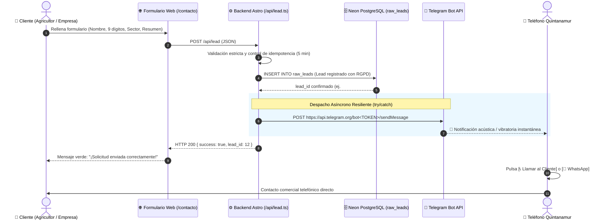

# 📲 Plan de Integración: Notificaciones Instantáneas por Bot de Telegram para Leads Comerciales

Este documento establece la arquitectura, especificación técnica y protocolo de resiliencia para el envío automático e instantáneo de notificaciones prioritarias a través de un **Bot privado de Telegram** cada vez que un cliente envía una solicitud de valoración técnica en la plataforma web de **Quintanamur S.L.** ([`/contacto`](file:///c:/Users/alexj/Quintanamur-web/src/pages/contacto.astro)).

---

## 🎯 1. Objetivos del Sistema

1. **Tiempo de Respuesta Inmediato (< 5 minutos):** Alertar al equipo comercial en su teléfono móvil personal o de empresa en menos de 1 segundo tras el envío en la web.
2. **Acción Telefónica en 1 Clic:** Permitir al comercial llamar directamente al agricultor o abrir un chat de WhatsApp con un solo toque en la pantalla de Telegram.
3. **Resiliencia y Aislamiento de Fallos:** El registro de la solicitud en la base de datos **Neon PostgreSQL (PostGIS)** tiene prioridad absoluta. Cualquier contingencia o microcorte temporal en la red de Telegram **jamás** bloqueará la confirmación de éxito en la web del cliente ni provocará la pérdida del lead.
4. **Cumplimiento RGPD:** Las alertas se transmiten cifradas por HTTPS de extremo a extremo y contienen únicamente los datos estrictamente necesarios para la atención comercial directa (principio de minimización de datos).

---

## 🏗️ 2. Arquitectura y Flujo de Datos



---

## 📋 3. Formato Visual del Mensaje en Telegram

El bot envía un mensaje con formato **HTML enriquecido** y un teclado en línea (*Inline Keyboard*) de botones interactivos:

```text
🚜 <b>¡NUEVA SOLICITUD DE VALORACIÓN!</b>
━━━━━━━━━━━━━━━━━━━━━━━━━━
👤 <b>Cliente:</b> Finca San José (Juan Pérez)
📞 <b>Teléfono:</b> 612345678
🏗️ <b>Sector:</b> Servicios Agrícolas
📍 <b>Ubicación:</b> Yecla / Jumilla (a 24 km)
📝 <b>Resumen:</b> Despedregado intensivo de 15 ha con rulo antes de siembra de almendros.
⏰ <b>Fecha:</b> 16/09/2026 13:45 h
━━━━━━━━━━━━━━━━━━━━━━━━━━
[ 📞 Llamar al Cliente ]    [ 💬 Abrir WhatsApp ]
```

### Comportamiento de los Botones:
* **`[ 📞 Llamar al Cliente ]`**: Enlace tipo `tel:+346XXXXXXXX` que abre directamente la aplicación de llamadas del smartphone con el número ya marcado.
* **`[ 💬 Abrir WhatsApp ]`**: Enlace `https://wa.me/346XXXXXXXX?text=...` que abre una conversación de WhatsApp con un mensaje de bienvenida pre-redactado:  
  *`Hola Juan Pérez, soy de Quintanamur. He recibido tu solicitud para "Despedregado intensivo de 15 ha...". ¿Hablamos?`*

---

## ⚙️ 4. Guía de Configuración Paso a Paso

Para conectar la web con Telegram se requieren **dos variables de entorno privadas**:

| Variable | Descripción | Ejemplo Ficticio |
| :--- | :--- | :--- |
| `TELEGRAM_BOT_TOKEN` | Token secreto generado por `@BotFather` | `123456789:ABCdefGhIJKlmNoPQRsTUVwxyZ` |
| `TELEGRAM_CHAT_ID` | ID numérico del usuario o grupo receptor | `123456789` |

### Paso 4.1: Creación del Bot en Telegram (si no estuviera creado)
1. En Telegram, busca el usuario oficial `@BotFather` (verificado con tic azul).
2. Envía el comando `/newbot`.
3. Asigna un nombre visible: `Quintanamur Avisos Web`.
4. Asigna un nombre de usuario terminado en `bot`: `quintanamur_leads_bot`.
5. Copia el token HTTP API que te entregará.

> [!TIP]
> **Si necesitas regenerar el token o copiarlo con un toque**:
> En el chat de `@BotFather`, escribe `/mybots` ➔ selecciona tu bot ➔ pulsa en **API Token**. Al tocar sobre el texto del token, Telegram lo copia íntegramente al portapapeles sin errores tipográficos.

### Paso 4.2: Obtener tu `TELEGRAM_CHAT_ID`
1. Busca en Telegram el bot `@userinfobot`.
2. Pulsa en **"Iniciar"**.
3. Copia el valor del campo `Id:` (número de 8 a 10 dígitos).

### Paso 4.3: Configuración para Grupos de Empresa (Multidispositivo)
Si deseas que la alerta suene simultáneamente en varios teléfonos (ej. personal + empresa o socios):
1. Crea un grupo en Telegram llamado *"Alertas Quintanamur"*.
2. Añade a los miembros que deben recibir las alertas.
3. Añade a tu bot como miembro del grupo.
4. Envía un mensaje cualquiera al grupo (ej. `hola`).
5. Abre en tu navegador:  
   `https://api.telegram.org/bot<TU_TOKEN>/getUpdates`
6. Busca el `chat.id` del grupo (los grupos en Telegram tienen un ID negativo, por ejemplo: `-1001234567890`).
7. Asigna ese ID negativo en la variable `TELEGRAM_CHAT_ID` de tu archivo `.env`.

---

## 🛡️ 5. Protocolo de Resiliencia Técnica en `/api/lead.ts`

El backend implementa un principio de **aislamiento de fallos**:

1. **Persistencia Transaccional Primero:** Los datos del lead se validan y se insertan en `raw_leads` de Neon.
2. **Notificación en `try/catch` Asíncrono:** La petición a la API de Telegram se ejecuta con un límite de tiempo de 4 segundos.
3. **Manejo de Excepciones:** Si Telegram no responde, está saturado o las credenciales no están configuradas, el sistema:
   * **No interrumpe la respuesta al usuario**: La web devuelve `HTTP 200 { success: true }`.
   * **Registra el error en los logs internos** del servidor para monitorización.
   * **El lead está garantizado en Neon**, por lo que ningún cliente potencial se pierde jamás.

---

## 🚀 6. Pruebas y Verificación

1. **Prueba de conexión HTTP:**
   ```bash
   curl -s "https://api.telegram.org/bot<TOKEN>/getMe"
   ```
2. **Prueba de mensaje de bienvenida:**
   ```bash
   curl -s -X POST "https://api.telegram.org/bot<TOKEN>/sendMessage" \
     -d "chat_id=<CHAT_ID>" \
     -d "text=🚜 Bot de Quintanamur conectado con éxito."
   ```
3. **Prueba integral desde la web:**
   Completar el formulario en `http://localhost:4321/contacto` y confirmar la recepción del mensaje interactivo en el móvil en menos de 2 segundos.
